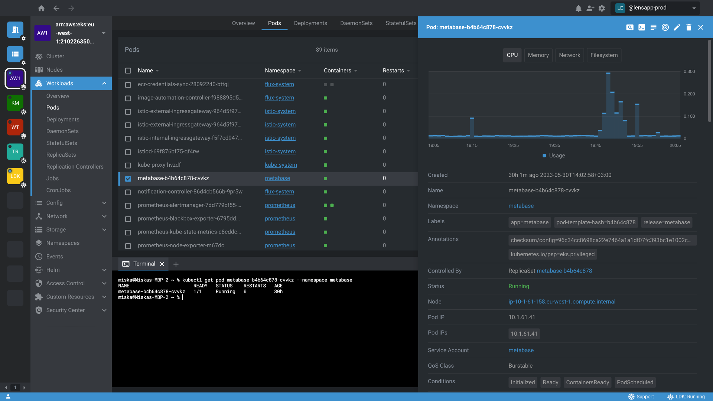

<!-- TEXT_SECTION:header:START -->

    <!-- glow seems to be not supported by GH
    

    -->
    

    <a href="https://k8slens.dev" target="_blank" rel="noopener noreferrer">
      <picture>
        <source media="(prefers-color-scheme: dark)" srcset="assets/lens-mirantis-logo.svg">
        <source media="(prefers-color-scheme: light)" srcset="assets/lens-mirantis-logo-black.svg">
        
      </picture>
    </a> 
  

  

    <a href="https://k8slens.dev" target="_blank">Lens Website</a>&nbsp;&#8226;&nbsp;
    <a href="https://store.k8slens.dev/products/lens-desktop-pro?plan=pro-monthly" target="_blank">Pricing</a>&nbsp;&#8226;&nbsp;
    <a href="https://forums.k8slens.dev" target="_blank">Forums</a>&nbsp;&#8226;&nbsp;
    <a href="https://docs.k8slens.dev" target="_blank">Docs</a>&nbsp;&#8226;&nbsp;
    <a href="https://www.mirantis.com/about/" target="_blank">Company</a>&nbsp;&#8226;&nbsp;
    <a href="https://k8slens.dev/purchase-request.html" target="_blank">Contact</a>
  

  <h3 align="center">
    The Way The World Runs Kubernetes
  </h3>
  

  Meet the new standard for cloud native software development & operations.  
  With over 1 million users, Lens is the most popular Kubernetes IDE in the world.
  

  

<!-- TEXT_SECTION:header:END -->

## What is Lens?

Designed for Developers and DevOps Engineers, Lens provides an unparalleled experience for managing and
troubleshooting Kubernetes workloads through one intuitive context-aware UI. For teams and organizations, Lens
has proven to be the most effective way to learn Kubernetes, boost team productivity and reduce tools required for
cloud native development. It's trusted by the world's best product teams; from innovative startups to iconic
enterprises. Lens is the #1 choice for Kubernetes with over 1 million users globally.

## This Repository

This repository contains the Lens extension API documentation.

Previously, this repository contained the source code for the open source version of Lens Desktop product. The open source version of Lens Desktop has been retired and is no longer maintained. The Lens Desktop product by Mirantis is still actively developed and supported by Mirantis, but contributions are now made through extensions using the Lens extension API, rather than directly to the core product. The legacy source code for the open source version is still available in the repository's history.

## Install

Download and install Lens Desktop from our [website](https://k8slens.dev).

## Getting Help

You can find answers to a huge variety of questions, along with a large community of helpful developers over on the [Lens Forums](https://forums.k8slens.dev) - replies are generally very quick. If you encounter issues or have any feature requests, you can post them in the public [community issues tracker](https://github.com/lensapp/lens/issues).

Lens Pro and Lens Enterprise customers also have access to 24/5 commercial support.

To stay up to date with all the latest news and product updates, make sure you subscribe to our blog — or you can always follow us on Twitter.

## Copyright & License

Copyright (c) 2024 Mirantis, Inc. - The content of this repository is released under the MIT license. Lens and the Lens Logo are trademarks of Mirantis, Inc.