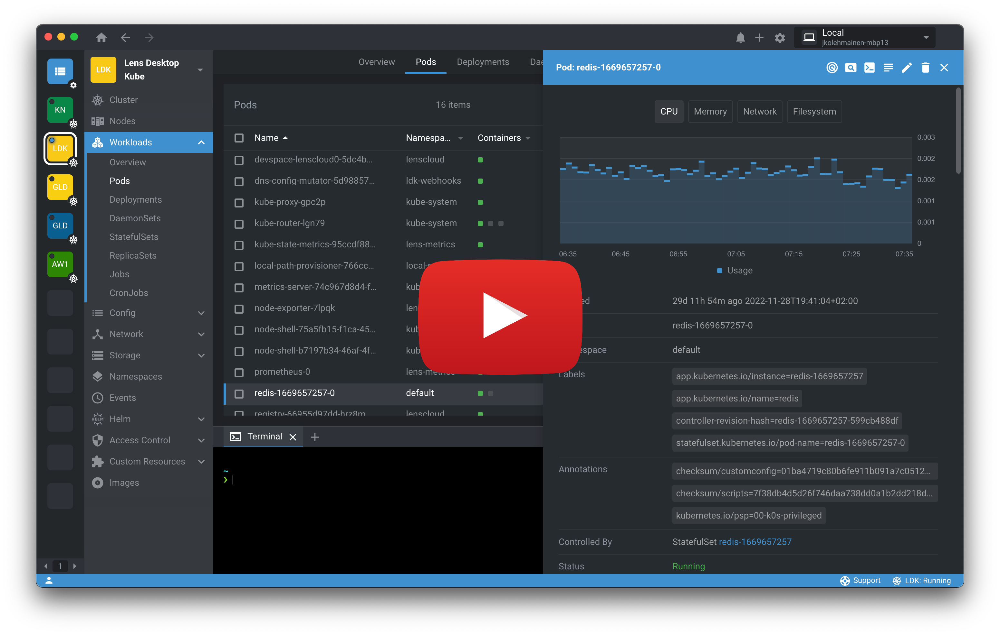

# Lens | The Kubernetes IDE

World’s most popular Kubernetes IDE provides a simplified, consistent entry point for developers, testers, integrators, and DevOps, to ship code faster at scale.  Lens is the only IDE you’ll ever need to take control of your Kubernetes clusters. It is a standalone application for MacOS, Windows and Linux operating systems.  Lens is an open source project and free!

## What makes Lens special?

* Amazing usability and end-user experience
* Unified, secure, multi-cluster management on any platform: support for hundreds of clusters
* Standalone application: no need to install anything in-cluster
* Lens installs anywhere, elimanting the need to wrangle credentials
* Real-time cluster state visualization
* Resource utilization charts and trends with history powered by built-in Prometheus
* Smart terminal access to nodes and containers
* Clusters can be local (e.g. minikube) or external (e.g. EKS, GKE, AKS)
* Performance optimized to handle massive clusters (tested with a cluster running 25k pods)
* RBAC security is preserved, as Lens uses the standard Kubernetes API
* Lens Extensions are used to add custom visualizations and functionality to accelerate development workflows for all the technologies and services that integrate with Kubernetes
* Helm package deployment: Browse and deploy Helm charts with one click-Install

## Installation

See [Getting Started](https://docs.k8slens.dev/latest/getting-started/) page.

## Development

See [Development](https://docs.k8slens.dev/latest/contributing/development/) page.

## Contributing

See [Contributing](https://docs.k8slens.dev/latest/contributing/) page.
