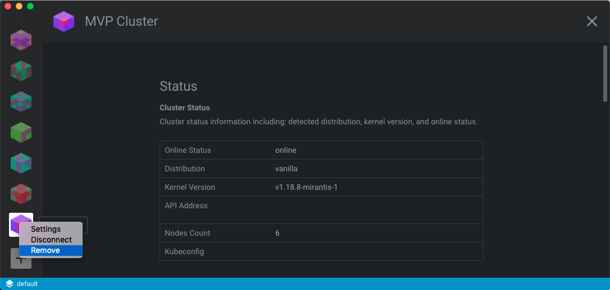

# Removing clusters

Remove Lens clusters using the context menu that appears when you right-click the cluster in the left-side menu that you want to remove. 

To remove a cluster from your cluster list:

1. Right-click the name of the cluster in the left-side menu that you want to remove. 
2. Click **Remove**.

**NOTE**: This will only remove the cluster from your Lens cluster list. It will not affect your actual Kubernetes cluster or its configuration.

