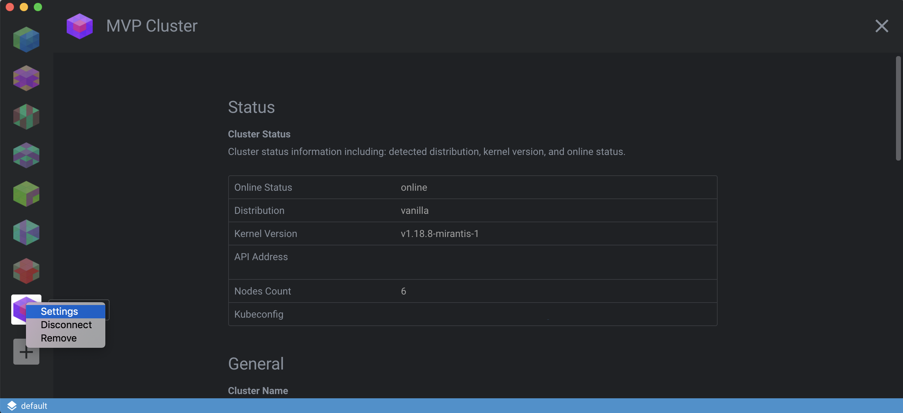

# Cluster Settings

It is easy to configure Lens Clusters to your liking through its various settings. By right-clicking the cluster of choice you can open the `Settings`.

## Cluster Status

This section in the cluster settings provides details including the detected distribution, kernel version, API endpoint and online status.

## General

### Cluster Name

### Workspace

### Cluster Icon

### HTTP Proxy

### Prometheus

### Working Directory

## Features

### Metrics

### User Mode
