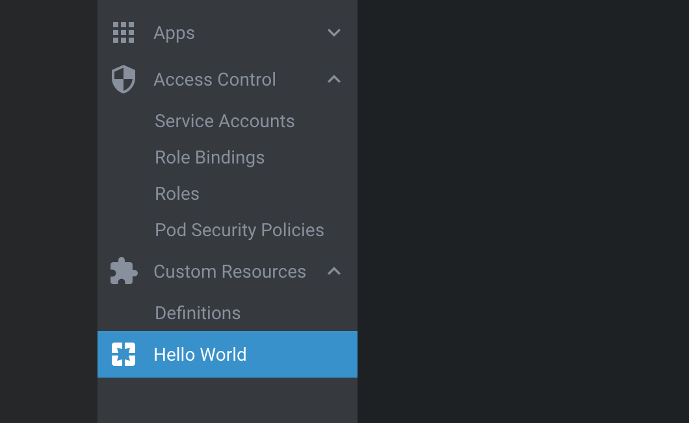
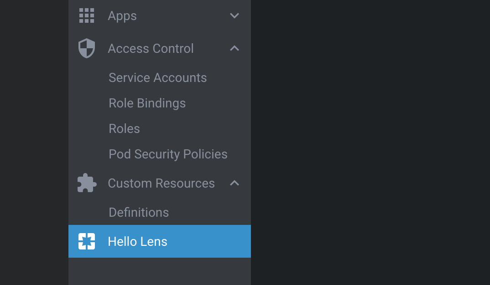

# Lens Extension Generator

The [Lens Extension Generator](https://github.com/lensapp/generator-lens-ext) creates a directory with the necessary files for developing an extension.

## Installing and Getting Started with the Generator

To begin, install Yeoman and the Lens Extension Generator with the following command:

```bash
npm install -g yo generator-lens-ext
```

Run the generator by entering the following command: `yo lens-ext`.

Answer the following questions:

```bash
# ? What type of extension do you want to create? New Extension (TypeScript)
# ? What's the name of your extension? my-first-lens-ext
# ? What's the description of your extension? My hello world extension
# ? What's your extension's publisher name? @my-org/my-first-lens-ext
# ? Initialize a git repository? Yes
# ? Install dependencies after initialization? Yes
# ? Which package manager to use? yarn
# ? symlink created extension folder to ~/.k8slens/extensions (mac/linux) or :Users\<user>\.k8slens\extensions (windows)? Yes
```

Next, you'll need to have webpack watch the `my-first-lens-ext` folder.
Start webpack by entering:

```bash
cd my-first-lens-ext
npm start # start the webpack server in watch mode
```

Open Lens and you will see a **Hello World** item in the left-side menu under **Custom Resources**:



## Developing the Extension

Next, you'll try changing the way the new menu item appears in the UI.
You'll change it from "Hello World" to "Hello Lens".

Open `my-first-lens-ext/renderer.tsx` and change the value of `title` from `"Hello World"` to `"Hello Lens"`:

```typescript
clusterPageMenus = [
  {
    target: { pageId: "hello" },
    title: "Hello Lens",
    components: {
      Icon: ExampleIcon,
    },
  },
];
```

Reload Lens and you will see that the menu item text has changed to "Hello Lens".
To reload Lens, enter `CMD+R` on Mac and `Ctrl+R` on Windows/Linux.



## Debugging the Extension

To debug your extension, please see our instructions on [Testing Extensions](../testing-and-publishing/testing.md).

## Next Steps

To dive deeper, consider looking at [Common Capabilities](../capabilities/common-capabilities.md), [Styling](../capabilities/styling.md), or [Extension Anatomy](anatomy.md).

If you find problems with the Lens Extension Generator, or have feature requests, you are welcome to raise an [issue](https://github.com/lensapp/generator-lens-ext/issues).
You can find the latest Lens contribution guidelines [here](https://docs.k8slens.dev/contributing).

The Generator source code is hosted at [GitHub](https://github.com/lensapp/generator-lens-ext).
