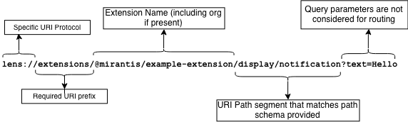

# Lens Protocol Handlers

Lens has a file association with the `lens://` protocol.
This means that Lens can be opened by external programs by providing a link that has `lens` as its protocol.
Lens provides a routing mechanism that extensions can use to register custom handlers.

## Registering A Protocol Handler

The field `protocolHandlers` exists both on [`LensMainExtension`](extensions/api/classes/lensmainextension/#protocolhandlers) and on [`LensRendererExtension`](extensions/api/classes/lensrendererextension/#protocolhandlers).
This field will be iterated through every time a `lens://` request gets sent to the application.
The `pathSchema` argument must comply with the [path-to-regexp](https://www.npmjs.com/package/path-to-regexp) package's `compileToRegex` function.

Once you have registered a handler it will be called when a user opens a link on their computer.
Handlers will be run in both `main` and `renderer` in parallel with no synchronization between the two processes.
Furthermore, both `main` and `renderer` are routed separately.
In other words, which handler is selected in either process is independent from the list of possible handlers in the other.

Example of registering a handler:

```typescript
import { Main, Common } from "@k8slens/extensions";

function rootHandler(params: Common.Types.ProtocolRouteParams) {
  console.log("routed to ExampleExtension", params);
}

export default class ExampleExtensionMain extends Main.LensExtension {
  protocolHandlers = [
    pathSchema: "/",
    handler: rootHandler,
  ]
}
```

For testing the routing of URIs the `open` (on macOS) or `xdg-open` (on most linux) CLI utilities can be used.
For the above handler, the following URI would be always routed to it:

```
open lens://extension/example-extension/
```

## Deregistering A Protocol Handler

All that is needed to deregister a handler is to remove it from the array of handlers.

## Routing Algorithm

The routing mechanism for extensions is quite straight forward.
For example consider an extension `example-extension` which is published by the `@mirantis` org.
If it were to register a handler with `"/display/:type"` as its corresponding link then we would match the following URI like this:



Once matched, the handler would be called with the following argument (note both `"search"` and `"pathname"` will always be defined):

```json
{
  "search": {
    "text": "Hello"
  },
  "pathname": {
    "type": "notification"
  }
}
```

As the diagram above shows, the search (or query) params are not considered as part of the handler resolution.
If the URI had instead been `lens://extension/@mirantis/example-extension/display/notification/green` then a third (and optional) field will have the rest of the path.
The `tail` field would be filled with `"/green"`.
If multiple `pathSchema`'s match a given URI then the most specific handler will be called.

For example consider the following `pathSchema`'s:

1. `"/"`
1. `"/display"`
1. `"/display/:type"`
1. `"/show/:id"`

The URI sub-path `"/display"` would be routed to #2 since it is an exact match.
On the other hand, the subpath `"/display/notification"` would be routed to #3.

The URI is routed to the most specific matching `pathSchema`.
This way the `"/"` (root) `pathSchema` acts as a sort of catch all or default route if no other route matches.
