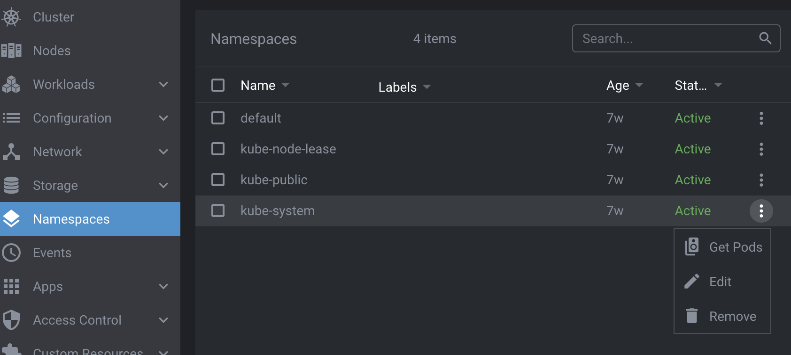

# Renderer Extension

The renderer extension api is the interface to Lens' renderer process (Lens runs in main and renderer processes). It allows you to access, configure, and customize Lens data, add custom Lens UI elements, and generally run custom code in Lens' renderer process. The custom Lens UI elements that can be added include global pages, cluster pages, cluster page menus, cluster features, app preferences, status bar items, KubeObject menu items, and KubeObject details items. These UI elements are based on React components.

## `LensRendererExtension` Class

To create a renderer extension simply extend the `LensRendererExtension` class:

``` typescript
import { LensRendererExtension } from "@k8slens/extensions";

export default class ExampleExtensionMain extends LensRendererExtension {
  onActivate() {
    console.log('custom renderer process extension code started');
  }

  onDeactivate() {
    console.log('custom renderer process extension de-activated');
  }
}
```

There are two methods that you can implement to facilitate running your custom code. `onActivate()` is called when your extension has been successfully enabled. By implementing `onActivate()` you can initiate your custom code. `onDeactivate()` is called when the extension is disabled (typically from the [Lens Extensions Page]()) and when implemented gives you a chance to clean up after your extension, if necessary. The example above simply logs messages when the extension is enabled and disabled. 

### `clusterPages`

Cluster pages appear as part of the cluster dashboard. They are accessible from the side bar, and are shown in the menu list after *Custom Resources*. It is conventional to use a cluster page to show information or provide functionality pertaining to the active cluster, along with custom data and functionality your extension may have. However, it is not limited to the active cluster. Also, your extension can gain access to the Kubernetes resources in the active cluster in a straightforward manner using the [`clusterStore`](../stores#clusterstore). 

The following example adds a cluster page definition to a `LensRendererExtension` subclass:

``` typescript
import { LensRendererExtension } from "@k8slens/extensions";
import { ExampleIcon, ExamplePage } from "./page"
import React from "react"

export default class ExampleExtension extends LensRendererExtension {
  clusterPages = [
    {
      id: "hello",
      components: {
        Page: () => <ExamplePage extension={this}/>,
      }
    }
  ];
}
```

Cluster pages are objects matching the `PageRegistration` interface. The `id` field identiifies the page, and at its simplest is just a string identifier, as shown in the example above. The 'id' field can also convey route path details, such as variable parameters provided to a page ([See example below]()). The `components` field matches the `PageComponents` interface for wich there is one field, `Page`.  `Page` is of type ` React.ComponentType<any>`, which gives you great flexibility in defining the appearance and behaviour of your page. For the example above `ExamplePage` can be defined in `page.tsx`:

``` typescript
import { LensRendererExtension } from "@k8slens/extensions";
import React from "react"

export class ExamplePage extends React.Component<{ extension: LensRendererExtension }> {
  render() {
    return (
      <div>
        <p>Hello world!</p>
      </div>
    )
  }
}
```

Note that the `ExamplePage` class defines a property named `extension`. This allows the `ExampleExtension` object to be passed in React-style in the cluster page definition, so that `ExamplePage` can access any `ExampleExtension` subclass data.

### `clusterPageMenus`

The above example code shows how to create a cluster page but not how to make it available to the Lens user. Cluster pages are typically made available through a menu item in the cluster dashboard sidebar. Expanding on the above example a cluster page menu is added to the `ExampleExtension` definition:

``` typescript
import { LensRendererExtension } from "@k8slens/extensions";
import { ExampleIcon, ExamplePage } from "./page"
import React from "react"

export default class ExampleExtension extends LensRendererExtension {
  clusterPages = [
    {
      id: "hello",
      components: {
        Page: () => <ExamplePage extension={this}/>,
      }
    }
  ];

  clusterPageMenus = [
    {
      target: { pageId: "hello" },
      title: "Hello World",
      components: {
        Icon: ExampleIcon,
      }
    },
  ];
}
```

Cluster page menus are objects matching the `ClusterPageMenuRegistration` interface. They define the appearance of the cluster page menu item in the cluster dashboard sidebar and the behaviour when the cluster page menu item is activated (typically by a mouse click). The example above uses the `target` field to set the behaviour as a link to the cluster page with `id` of `"hello"`. This is done by setting `target`'s `pageId` field to `"hello"`. The cluster page menu item's appearance is defined by setting the `title` field to the text that is to be displayed in the cluster dashboard sidebar. The `components` field is used to set an icon that appears to the left of the `title` text in the sidebar. Thus when the `"Hello World"` menu item is activated the cluster dashboard will show the contents of `ExamplePage`. This example requires the definition of another React-based component, `ExampleIcon`, which has been added to `page.tsx`:

``` typescript
import { LensRendererExtension, Component } from "@k8slens/extensions";
import React from "react"

export function ExampleIcon(props: Component.IconProps) {
  return <Component.Icon {...props} material="pages" tooltip={"Hi!"}/>
}

export class ExamplePage extends React.Component<{ extension: LensRendererExtension }> {
  render() {
    return (
      <div>
        <p>Hello world!</p>
      </div>
    )
  }
}
```

`ExampleIcon` introduces one of Lens' built-in components available to extension developers, the `Component.Icon`. Built in are the [Material Design](https://material.io) [icons](https://material.io/resources/icons/). One can be selected by name via the `material` field. `ExampleIcon` also sets a tooltip, shown when the Lens user hovers over the icon with a mouse, by setting the `tooltip` field.

A cluster page menu can also be used to define a foldout submenu in the cluster dashboard sidebar. This enables the grouping of cluster pages. The following example shows how to specify a submenu having two menu items:

``` typescript
import { LensRendererExtension } from "@k8slens/extensions";
import { ExampleIcon, ExamplePage } from "./page"
import React from "react"

export default class ExampleExtension extends LensRendererExtension {
  clusterPages = [
    {
      id: "hello",
      components: {
        Page: () => <ExamplePage extension={this}/>,
      }
    },
    {
      id: "bonjour", 
      components: {
        Page: () => <ExemplePage extension={this}/>,
      }
    }
  ];

  clusterPageMenus = [
    {
      id: "example",
      title: "Greetings",
      components: {
        Icon: ExampleIcon,
      }
    },
    {
      parentId: "example",
      target: { pageId: "hello" },
      title: "Hello World",
      components: {
        Icon: ExampleIcon,
      }
    },
    {
      parentId: "example",
      target: { pageId: "bonjour" },
      title: "Bonjour le monde",
      components: {
        Icon: ExempleIcon,
      }
    }
  ];
}
```

The above defines two cluster pages and three cluster page menu objects. The cluster page definitons are straightforward. The first cluster page menu object defines the parent of a foldout submenu. Setting the `id` field in a cluster page menu definition implies that it is defining a foldout submenu. Also note that the `target` field is not specified (it is ignored if the `id` field is specified). This cluster page menu object specifies the `title` and `components` fields, which are used in displaying the menu item in the cluster dashboard sidebar. Initially the submenu is hidden. Activating this menu item toggles on and off the appearance of the submenu below it. The remaining two cluster page menu objects define the contents of the submenu. A cluster page menu object is defined to be a submenu item by setting the `parentId` field to the id of the parent of a foldout submenu, `"example"` in this case

### `globalPages`

Global pages appear independently of the cluster dashboard and they fill the Lens UI space. A global page is typically triggered from the cluster menu using a [global page menu](#globalpagemenus). They can also be triggered by a [custom app menu selection](../main-extension#appmenus) from a Main Extension or a [custom status bar item](#statusbaritems). Global pages can appear even when there is no active cluster, unlike cluster pages. It is conventional to use a global page to show information and provide functionality relevant across clusters, along with custom data and functionality that your extension may have. 

The following example defines a `LensRendererExtension` subclass with a single global page definition:

``` typescript
import { LensRendererExtension } from '@k8slens/extensions';
import { HelpPage } from './page';
import React from 'react';

export default class HelpExtension extends LensRendererExtension {
  globalPages = [
    {
      id: "help",
      components: {
        Page: () => <HelpPage extension={this}/>,
      }
    }
  ];
}
```

Global pages are objects matching the `PageRegistration` interface. The `id` field identiifies the page, and at its simplest is just a string identifier, as shown in the example above. The 'id' field can also convey route path details, such as variable parameters provided to a page ([See example below]()). The `components` field matches the `PageComponents` interface for which there is one field, `Page`.  `Page` is of type ` React.ComponentType<any>`, which gives you great flexibility in defining the appearance and behaviour of your page. For the example above `HelpPage` can be defined in `page.tsx`:

``` typescript
import { LensRendererExtension } from "@k8slens/extensions";
import React from "react"

export class HelpPage extends React.Component<{ extension: LensRendererExtension }> {
  render() {
    return (
      <div>
        <p>Help yourself</p>
      </div>
    )
  }
}
```

Note that the `HelpPage` class defines a property named `extension`. This allows the `HelpExtension` object to be passed in React-style in the global page definition, so that `HelpPage` can access any `HelpExtension` subclass data. 

This example code shows how to create a global page but not how to make it available to the Lens user. Global pages are typically made available through a number of ways. Menu items can be added to the Lens app menu system and set to open a global page when activated (See [`appMenus` in the Main Extension guide](../main-extension#appmenus)). Interactive elements can be placed on the status bar (the blue strip along the bottom of the Lens UI) and can be configured to link to a global page when activated (See [`statusBarItems`](#statusbaritems)). As well, global pages can be made accessible from the cluster menu, which is the vertical strip along the left side of the Lens UI showing the available cluster icons, and the Add Cluster icon. Global page menu icons that are defined using [`globalPageMenus`](#globalpagemenus) appear below the Add Cluster icon.

### `globalPageMenus`

Global page menus connect a global page to the cluster menu, which is the vertical strip along the left side of the Lens UI showing the available cluster icons, and the Add Cluster icon. Expanding on the example from [`globalPages`](#globalPages) a global page menu is added to the `HelpExtension` definition:

``` typescript
import { LensRendererExtension } from "@k8slens/extensions";
import { HelpIcon, HelpPage } from "./page"
import React from "react"

export default class HelpExtension extends LensRendererExtension {
  globalPages = [
    {
      id: "help",
      components: {
        Page: () => <HelpPage extension={this}/>,
      }
    }
  ];

  globalPageMenus = [
    {
      target: { pageId: "help" },
      title: "Help",
      components: {
        Icon: HelpIcon,
      }
    },
  ];
}
```

Global page menus are objects matching the `PageMenuRegistration` interface. They define the appearance of the global page menu item in the cluster menu and the behaviour when the global page menu item is activated (typically by a mouse click). The example above uses the `target` field to set the behaviour as a link to the global page with `id` of `"help"`. This is done by setting `target`'s `pageId` field to `"help"`. The global page menu item's appearance is defined by setting the `title` field to the text that is to be displayed as a tooltip in the cluster menu. The `components` field is used to set an icon that appears in the cluster menu. Thus when the `"Help"` icon is activated the contents of `ExamplePage` will be shown. This example requires the definition of another React-based component, `HelpIcon`, which has been added to `page.tsx`:

``` typescript
import { LensRendererExtension, Component } from "@k8slens/extensions";
import React from "react"

export function HelpIcon(props: Component.IconProps) {
  return <Component.Icon {...props} material="help"/>
}

export class HelpPage extends React.Component<{ extension: LensRendererExtension }> {
  render() {
    return (
      <div>
        <p>Help</p>
      </div>
    )
  }
}
```

`HelpIcon` introduces one of Lens' built-in components available to extension developers, the `Component.Icon`. Built in are the [Material Design](https://material.io) [icons](https://material.io/resources/icons/). One can be selected by name via the `material` field. 

### `clusterFeatures`

Cluster features are Kubernetes resources that can be applied to and managed within the active cluster. They can be installed/uninstalled by the Lens user from the [cluster settings page](). 
The following example shows how to add a cluster feature as part of a `LensRendererExtension`:

``` typescript
import { LensRendererExtension } from "@k8slens/extensions"
import { ExampleFeature } from "./src/example-feature"
import React from "react"

export default class ExampleFeatureExtension extends LensRendererExtension {
  clusterFeatures = [
    {
      title: "Example Feature",
      components: {
        Description: () => {
          return (
            <span>
                Enable an example feature.
            </span>
          )
        }
      },
      feature: new ExampleFeature()
    }
  ];
}
```
The `title` and `components.Description` fields provide content that appears on the cluster settings page, in the **Features** section. The `feature` field must specify an instance which extends the abstract class `ClusterFeature.Feature`, and specifically implement the following methods:

``` typescript
  abstract install(cluster: Cluster): Promise<void>;
  abstract upgrade(cluster: Cluster): Promise<void>;
  abstract uninstall(cluster: Cluster): Promise<void>;
  abstract updateStatus(cluster: Cluster): Promise<ClusterFeatureStatus>;
```

The `install()` method is typically called by Lens when a user has indicated that this feature is to be installed (i.e. clicked **Install** for the feature on the cluster settings page). The implementation of this method should install kubernetes resources using the `applyResources()` method, or by directly accessing the kubernetes api ([`K8sApi`](tbd)).

The `upgrade()` method is typically called by Lens when a user has indicated that this feature is to be upgraded (i.e. clicked **Upgrade** for the feature on the cluster settings page). The implementation of this method should upgrade the kubernetes resources already installed, if relevant to the feature.

The `uninstall()` method is typically called by Lens when a user has indicated that this feature is to be uninstalled (i.e. clicked **Uninstall** for the feature on the cluster settings page). The implementation of this method should uninstall kubernetes resources using the kubernetes api (`K8sApi`)

The `updateStatus()` method is called periodically by Lens to determine details about the feature's current status. The implementation of this method should provide the current status information in the `status` field of the `ClusterFeature.Feature` parent class. The `status.currentVersion` and `status.latestVersion` fields may be displayed by Lens in describing the feature. The `status.installed` field should be set to true if the feature is currently installed, otherwise false. Also, Lens relies on the `status.canUpgrade` field to determine if the feature can be upgraded (i.e a new version could be available) so the implementation should set the `status.canUpgrade` field according to specific rules for the feature, if relevant.

The following shows a very simple implementation of a `ClusterFeature`:

``` typescript
import { ClusterFeature, Store, K8sApi } from "@k8slens/extensions";
import * as path from "path";

export class ExampleFeature extends ClusterFeature.Feature {

  async install(cluster: Store.Cluster): Promise<void> {

    super.applyResources(cluster, path.join(__dirname, "../resources/"));
  }

  async upgrade(cluster: Store.Cluster): Promise<void> {
    return this.install(cluster);
  }

  async updateStatus(cluster: Store.Cluster): Promise<ClusterFeature.FeatureStatus> {
    try {
      const pod = K8sApi.forCluster(cluster, K8sApi.Pod);
      const examplePod = await pod.get({name: "example-pod", namespace: "default"});
      if (examplePod?.kind) {
        this.status.installed = true;
        this.status.currentVersion = examplePod.spec.containers[0].image.split(":")[1];
        this.status.canUpgrade = true;  // a real implementation would perform a check here that is relevant to the specific feature 
      } else {
        this.status.installed = false;
        this.status.canUpgrade = false;
      }
    } catch(e) {
      if (e?.error?.code === 404) {
        this.status.installed = false;
        this.status.canUpgrade = false;
      }
    }

    return this.status;
  }

  async uninstall(cluster: Store.Cluster): Promise<void> {
    const podApi = K8sApi.forCluster(cluster, K8sApi.Pod);
    await podApi.delete({name: "example-pod", namespace: "default"});
  }
}
```

This example implements the `install()` method by simply invoking the helper `applyResources()` method. `applyResources()` tries to apply all resources read from all files found in the folder path provided. In this case this folder path is the `../resources` subfolder relative to current source code's folder. The file `../resources/example-pod.yml` could contain:

``` yaml
apiVersion: v1
kind: Pod
metadata:
  name: example-pod
spec:
  containers:
  - name: example-pod
    image: nginx
```

The `upgrade()` method in the example above is implemented by simply invoking the `install()` method. Depending on the feature to be supported by an extension, upgrading may require additional and/or different steps.

The `uninstall()` method is implemented in the example above by utilizing the [`K8sApi`](tbd) provided by Lens to simply delete the `example-pod` pod applied by the `install()` method.

The `updateStatus()` method is implemented above by using the [`K8sApi`](tbd) as well, this time to get information from the `example-pod` pod, in particular to determine if it is installed, what version is associated with it, and if it can be upgraded. How the status is updated for a specific cluster feature is up to the implementation. 

### `appPreferences`

The Preferences page is a built-in global page. Extensions can add custom preferences to the Preferences page, thus providing a single location for users to configure global options, for Lens and extensions alike. The following example demonstrates adding a custom preference:

``` typescript
import { LensRendererExtension } from "@k8slens/extensions";
import { ExamplePreference, ExamplePreferenceHint, ExamplePreferenceInput } from "./src/example-preference";
import { observable } from "mobx";
import React from "react";

export default class ExampleRendererExtension extends LensRendererExtension {

  @observable preference: ExamplePreference = { enabled: false };

  appPreferences = [
    {
      title: "Example Preferences",
      components: {
        Input: () => <ExamplePreferenceInput preference={this.preference}/>,
        Hint: () => <ExamplePreferenceHint/>
      }
    }
  ];
}
```

App preferences are objects matching the `AppPreferenceRegistration` interface. The `title` field specifies the text to show as the heading on the Preferences page. The `components` field specifies two `React.Component` objects defining the interface for the preference. `Input` should specify an interactive input element for your preference and `Hint` should provide descriptive information for the preference, which is shown below the `Input` element. `ExamplePreferenceInput` expects its React props set to an `ExamplePreference` instance, which is how `ExampleRendererExtension` handles the state of the preference input. `ExampleRendererExtension` has the field `preference`, which is provided to `ExamplePreferenceInput` when it is created. In this example `ExamplePreferenceInput`, `ExamplePreferenceHint`, and `ExamplePreference` are defined in `./src/example-preference.tsx`:

``` typescript
import { Component } from "@k8slens/extensions";
import { observer } from "mobx-react";
import React from "react";

export type ExamplePreference  = {
  enabled: boolean;
}

@observer
export class ExamplePreferenceInput extends React.Component<{preference: ExamplePreference}, {}> {

  render() {
    const { preference } = this.props;
    return (
      <Component.Checkbox
        label="I understand appPreferences"
        value={preference.enabled}
        onChange={v => { preference.enabled = v; }}
      />
    );
  }
}

export class ExamplePreferenceHint extends React.Component {
  render() {
    return (
      <span>This is an example of an appPreference for extensions.</span>
    );
  }
}
```

`ExamplePreferenceInput` implements a simple checkbox (using Lens' `Component.Checkbox`). It provides `label` as the text to display next to the checkbox and an `onChange` function, which reacts to the checkbox state change. The checkbox's `value` is initially set to `preference.enabled`. `ExamplePreferenceInput` is defined with React props of `ExamplePreference` type, which has a single field, `enabled`. This is used to indicate the state of the preference, and is bound to the checkbox state in `onChange`. `ExamplePreferenceHint` is a simple text span. Note that the input and the hint could comprise of more sophisticated elements, according to the needs of the extension.

Note that the above example introduces decorators `observable` and `observer` from the [`mobx`](https://mobx.js.org/README.html) and [`mobx-react`](https://github.com/mobxjs/mobx-react#mobx-react) packages. `mobx` simplifies state management and without it this example would not visually update the checkbox properly when the user activates it. [Lens uses `mobx` extensively for state management](../working-with-mobx) of its own UI elements and it is recommended that extensions rely on it too. Alternatively, React's state management can be used instead, though `mobx` is typically simpler to use.

Also note that an extension's state data can be managed using an `ExtensionStore` object, which conveniently handles persistence and synchronization. The example above defined an `ExamplePreference` type to hold the extension's state to simplify the code for this guide, but it is recommended to manage your extension's state data using [`ExtensionStore`](../stores#extensionstore) 

### `statusBarItems`

The Status bar is the blue strip along the bottom of the Lens UI. Status bar items are `React.ReactNode` types, which can be used to convey status information, or act as a link to a global page, or even an external page.

The following example adds a status bar item definition, as well as a global page definition, to a `LensRendererExtension` subclass, and configures the status bar item to navigate to the global page upon activation (normally a mouse click):

``` typescript
import { LensRendererExtension } from '@k8slens/extensions';
import { HelpIcon, HelpPage } from "./page"
import React from 'react';

export default class HelpExtension extends LensRendererExtension {
  globalPages = [
    {
      id: "help",
      components: {
        Page: () => <HelpPage extension={this}/>,
      }
    }
  ];

  statusBarItems = [
    {
      item: (
        <div
          className="flex align-center gaps"
          onClick={() => this.navigate("help")}
        >
          <HelpIcon />
          My Status Bar Item
        </div>
      ),
    },
  ];
}
```

The `item` field of a status bar item specifies the `React.Component` to be shown on the status bar. By default items are added starting from the right side of the status bar. Typically, `item` would specify an icon and/or a short string of text, considering the limited space on the status bar. In the example above the `HelpIcon` from the [`globalPageMenus` guide](#globalpagemenus) is reused. Also, the `item` provides a link to the global page by setting the `onClick` property to a function that calls the `LensRendererExtension` `navigate()` method. `navigate()` takes as a parameter the id of the global page, which is shown when `navigate()` is called. 

### `kubeObjectMenuItems`

An extension can add custom menu items (including actions) for specific Kubernetes resource kinds/apiVersions. These menu items appear under the `...` for each listed resource in the cluster dashboard, and on the title bar of the details page for a specific resource:




The following example shows how to add a menu for Namespace resources, and associate an action with it:

``` typescript
import React from "react"
import { LensRendererExtension } from "@k8slens/extensions";
import { NamespaceMenuItem } from "./src/namespace-menu-item"

export default class ExampleExtension extends LensRendererExtension {
  kubeObjectMenuItems = [
    {
      kind: "Namespace",
      apiVersions: ["v1"],
      components: {
        MenuItem: (props: Component.KubeObjectMenuProps<K8sApi.Namespace>) => <NamespaceMenuItem {...props} />
      }
    }
  ];
}

```

Kube object menu items are objects matching the `KubeObjectMenuRegistration` interface. The `kind` field specifies the kubernetes resource type to apply this menu item to, and the `apiVersion` field specifies the kubernetes api to use in relation to this resource type. This example adds a menu item for namespaces in the cluster dashboard. The `components` field defines the menu item's appearance and behaviour. The `MenuItem` field provides a function that returns a `React.Component` given a set of menu item properties. In this example a `NamespaceMenuItem` object is returned. `NamespaceMenuItem` is defined in `./src/namespace-menu-item.tsx`:

``` tsx
import React from "react";
import { Component, K8sApi, Navigation} from "@k8slens/extensions";

export function NamespaceMenuItem(props: Component.KubeObjectMenuProps<K8sApi.Namespace>) {
  const { object: namespace, toolbar } = props;
  if (!namespace) return null;

  const namespaceName = namespace.getName();

  const sendToTerminal = (command: string) => {
    Component.terminalStore.sendCommand(command, {
      enter: true,
      newTab: true,
    });
    Navigation.hideDetails();
  };

  const getPods = () => {
    sendToTerminal(`kubectl get pods -n ${namespaceName}`);
  };

  return (
    <Component.MenuItem onClick={getPods}>
    <Component.Icon material="speaker_group" interactive={toolbar} title="Get pods in terminal"/>
    <span className="title">Get Pods</span>
    </Component.MenuItem>
  );
}

```

`NamespaceMenuItem` returns a `Component.MenuItem` defining the menu item's appearance (icon and text) and behaviour when activated via the `onClick` property. `getPods()` shows how to open a terminal tab and run a command, specifically it runs `kubectl` to get a list of pods running in the current namespace. See [`Component.terminalStore.sendCommand`](api-docs?) for more details on running terminal commands. The name of the namespace is retrieved from `props` passed into `NamespaceMenuItem()`. `namespace` is the `props.object`, which is of type `K8sApi.Namespace`. This is the api for accessing namespaces, and the current namespace in this example is simply given by `namespace.getName()`. Thus kube object menu items are afforded convenient access to the specific resource selected by the user.

### `kubeObjectDetailItems`

An extension can add custom details (content) for specified Kubernetes resource kinds/apiVersions. These custom details appear on the details page for a specific resource, such as a Namespace:


The following example shows how to add a tabulated list of pods to the Namespace resource details page:

``` typescript
import React from "react"
import { LensRendererExtension } from "@k8slens/extensions";
import { NamespaceDetailsItem } from "./src/namespace-details-item"

export default class ExampleExtension extends LensRendererExtension {
  kubeObjectDetailItems = [
    {
      kind: "Namespace",
      apiVersions: ["v1"],
      priority: 10,
      components: {
        Details: (props: Component.KubeObjectDetailsProps<K8sApi.Namespace>) => <NamespaceDetailsItem {...props} />
      }
    }
  ];
}
```

Kube object detail items are objects matching the `KubeObjectDetailRegistration` interface. The `kind` field specifies the kubernetes resource type to apply this detail item to, and the `apiVersion` field specifies the kubernetes api to use in relation to this resource type. This example adds a detail item for namespaces in the cluster dashboard. The `components` field defines the detail item's appearance and behaviour. The `Details` field provides a function that returns a `React.Component` given a set of detail item properties. In this example a `NamespaceDetailsItem` object is returned. `NamespaceDetailsItem` is defined in `./src/namespace-details-item.tsx`:

``` typescript
import { Component, K8sApi } from "@k8slens/extensions";
import { PodsDetailsList } from "./pods-details-list";
import React from "react";
import { observable } from "mobx";
import { observer } from "mobx-react";

@observer
export class NamespaceDetailsItem extends React.Component<Component.KubeObjectDetailsProps<K8sApi.Namespace>> {

  @observable private pods: K8sApi.Pod[];

  async componentDidMount() {
    this.pods = await K8sApi.podsApi.list({namespace: this.props.object.getName()});
  }

  render() {
    return (
      <div>
        <Component.DrawerTitle title="Pods" />
        <PodsDetailsList pods={this.pods}/>
      </div>
    )
  }
}
```

Since `NamespaceDetailsItem` extends `React.Component<Component.KubeObjectDetailsProps<K8sApi.Namespace>>` it can access the current namespace object (type `K8sApi.Namespace`) through `this.props.object`. This object can be queried for many details about the current namespace. In this example the namespace's name is obtained in `componentDidMount()` using the `K8sApi.Namespace` `getName()` method. The namespace's name is needed to limit the list of pods to only those in this namespace. To get the list of pods this example uses the kubernetes pods api, specifically the `K8sApi.podsApi.list()` method. The `K8sApi.podsApi` is automatically configured for the currently active cluster.

Note that `K8sApi.podsApi.list()` is an asynchronous method, and ideally getting the pods list should be done before rendering the `NamespaceDetailsItem`. It is a common technique in React development to await async calls in `componentDidMount()`. However, `componentDidMount()` is called right after the first call to `render()`. In order to effect a subsequent `render()` call React must be made aware of a state change. Like in the [`appPreferences` guide](#apppreferences), [`mobx`](https://mobx.js.org/README.html) and [`mobx-react`](https://github.com/mobxjs/mobx-react#mobx-react) are used to ensure `NamespaceDetailsItem` renders when the pods list is updated. This is done simply by marking the `pods` field as an `observable` and the `NamespaceDetailsItem` class itself as an `observer`.

Finally, the `NamespaceDetailsItem` is rendered using the `render()` method. Details are placed in drawers, and using `Component.DrawerTitle` provides a separator from details above this one. Multiple details in a drawer can be placed in `<Component.DrawerItem>` elements for further separation, if desired. The rest of this example's details are defined in `PodsDetailsList`, found in `./pods-details-list.tsx`:

``` tsx
import React from "react";
import { Component, K8sApi } from "@k8slens/extensions";

interface Props {
  pods: K8sApi.Pod[];
}

export class PodsDetailsList extends React.Component<Props> {

  getTableRow(index: number) {
      const {pods} = this.props;
      return (
          <Component.TableRow key={index} nowrap>
              <Component.TableCell className="podName">{pods[index].getName()}</Component.TableCell>
              <Component.TableCell className="podAge">{pods[index].getAge()}</Component.TableCell>
              <Component.TableCell className="podStatus">{pods[index].getStatus()}</Component.TableCell>
          </Component.TableRow>
      )
  }

  render() {
      const {pods} = this.props
      if (!pods?.length) {
          return null;
      }

      return (
          <div >
              <Component.Table>
                  <Component.TableHead>
                      <Component.TableCell className="podName">Name</Component.TableCell>
                      <Component.TableCell className="podAge">Age</Component.TableCell>
                      <Component.TableCell className="podStatus">Status</Component.TableCell>
                  </Component.TableHead>
                  {
                      pods.map((pod, index) => this.getTableRow(index))
                  }
              </Component.Table>
          </div>
      )
  }
}
```

`PodsDetailsList` produces a simple table showing a list of the pods found in this namespace:


 For each pod the name, age, and status are obtained using the `K8sApi.Pod` methods. The table is constructed using the `Component.Table` and related elements. See [`Component` documentation](url?) for further details.