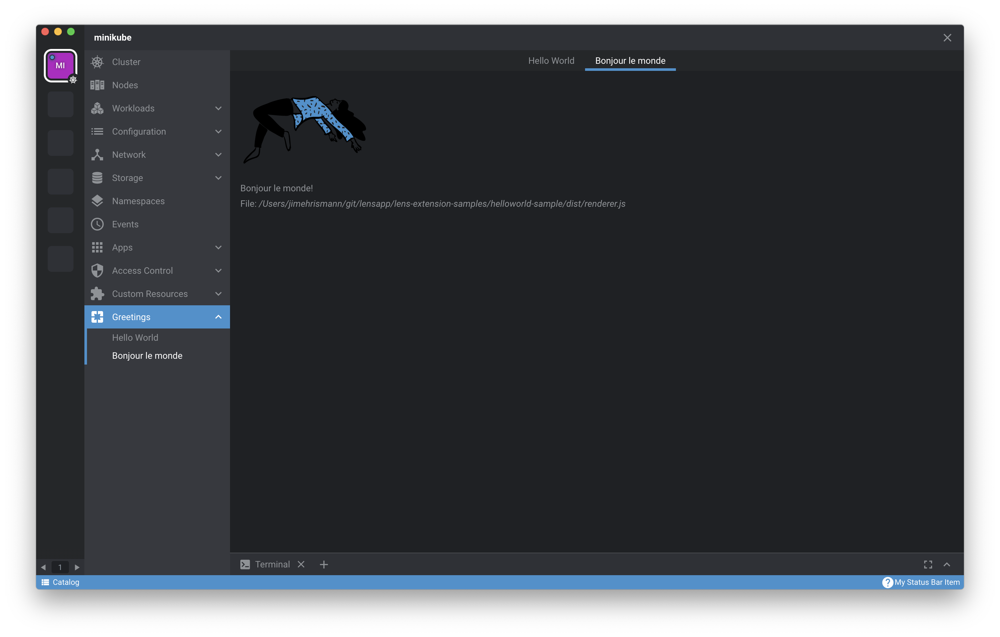

# Renderer Extension (WIP)

The Renderer Extension API is the interface to Lens's renderer process.
Lens runs in both the main and renderer processes.
The Renderer Extension API allows you to access, configure, and customize Lens data, add custom Lens UI elements, protocol handlers, and command palette commands, as well as run custom code in Lens's renderer process.

The custom Lens UI elements that you can add include:

- [Cluster pages](#clusterpages)
- [Cluster page menus](#clusterpagemenus)
- [Global pages](#globalpages)
- [Welcome menus](#welcomemenus)
- [App preferences](#apppreferences)
- [Top bar items](#topbaritems)
- [Status bar items](#statusbaritems)
- [KubeObject menu items](#kubeobjectmenuitems)
- [KubeObject detail items](#kubeobjectdetailitems)
- [KubeObject status texts](#kubeobjectstatustexts)
- [Kube workloads overview items](#kubeworkloadsoverviewitems)

as well as catalog-related UI elements:

- [Entity settings](#entitysettings)
- [Catalog entity detail items](#catalogentitydetailitems)

All UI elements are based on React components.

Finally, you can also add commands and protocol handlers:

- [Command palette commands](#commandpalettecommands)
- [protocol handlers](protocol-handlers.md)

## `Renderer.LensExtension` Class

### `onActivate()` and `onDeactivate()` Methods

To create a renderer extension, extend the `Renderer.LensExtension` class:

```typescript
import { Renderer } from "@k8slens/extensions";

export default class ExampleExtensionMain extends Renderer.LensExtension {
  onActivate() {
    console.log("custom renderer process extension code started");
  }

  onDeactivate() {
    console.log("custom renderer process extension de-activated");
  }
}
```

Two methods enable you to run custom code: `onActivate()` and `onDeactivate()`.
Enabling your extension calls `onActivate()` and disabling your extension calls `onDeactivate()`.
You can initiate custom code by implementing `onActivate()`.
Implementing `onDeactivate()` gives you the opportunity to clean up after your extension.

!!! info
Disable extensions from the Lens Extensions page:

    1. Navigate to **File** > **Extensions** in the top menu bar.
    (On Mac, it is **Lens** > **Extensions**.)
    2. For the extension you want to disable, open the context menu (click on the three vertical dots) and choose **Disable**.

The example above logs messages when the extension is enabled and disabled.

### `clusterPages`

Cluster pages appear in the cluster dashboard.
Use cluster pages to display information about or add functionality to the active cluster.
It is also possible to include custom details from other clusters.
Use your extension to access Kubernetes resources in the active cluster with [`ClusterStore.getInstance()`](../stores#Clusterstore).

Add a cluster page definition to a `Renderer.LensExtension` subclass with the following example:

```typescript
import { Renderer } from "@k8slens/extensions";
import { ExampleIcon, ExamplePage } from "./page";
import React from "react";

export default class ExampleExtension extends Renderer.LensExtension {
  clusterPages = [
    {
      id: "hello",
      components: {
        Page: () => <ExamplePage extension={this} />,
      },
    },
  ];
}
```

`clusterPages` is an array of objects that satisfy the `PageRegistration` interface.
The properties of the `clusterPages` array objects are defined as follows:

- `id` is a string that identifies the page.
- `components` matches the `PageComponents` interface for which there is one field, `Page`.
- `Page` is of type ` React.ComponentType<any>`.
  It offers flexibility in defining the appearance and behavior of your page.

`ExamplePage` in the example above can be defined in `page.tsx`:

```typescript
import { Renderer } from "@k8slens/extensions";
import React from "react";

export class ExamplePage extends React.Component<{
  extension: LensRendererExtension;
}> {
  render() {
    return (
      <div>
        <p>Hello world!</p>
      </div>
    );
  }
}
```

Note that the `ExamplePage` class defines the `extension` property.
This allows the `ExampleExtension` object to be passed in the cluster page definition in the React style.
This way, `ExamplePage` can access all `ExampleExtension` subclass data.

The above example shows how to create a cluster page, but not how to make that page available to the Lens user.
Use `clusterPageMenus`, covered in the next section, to add cluster pages to the Lens UI.

### `clusterPageMenus`

`clusterPageMenus` allows you to add cluster page menu items to the secondary left nav, below Lens's standard cluster menus like **Workloads**, **Custom Resources**, etc.

By expanding on the above example, you can add a cluster page menu item to the `ExampleExtension` definition:

```typescript
import { Renderer } from "@k8slens/extensions";
import { ExampleIcon, ExamplePage } from "./page";
import React from "react";

export default class ExampleExtension extends Renderer.LensExtension {
  clusterPages = [
    {
      id: "hello",
      components: {
        Page: () => <ExamplePage extension={this} />,
      },
    },
  ];

  clusterPageMenus = [
    {
      target: { pageId: "hello" },
      title: "Hello World",
      components: {
        Icon: ExampleIcon,
      },
    },
  ];
}
```

`clusterPageMenus` is an array of objects that satisfy the `ClusterPageMenuRegistration` interface.
This element defines how the cluster page menu item will appear and what it will do when you click it.
The properties of the `clusterPageMenus` array objects are defined as follows:

- `target` links to the relevant cluster page using `pageId`.
- `pageId` takes the value of the relevant cluster page's `id` property.
- `title` sets the name of the cluster page menu item that will appear in the left side menu.
- `components` is used to set an icon that appears to the left of the `title` text in the left side menu.

The above example creates a menu item that reads **Hello World**.
When users click **Hello World**, the cluster dashboard will show the contents of `Example Page`.

This example requires the definition of another React-based component, `ExampleIcon`, which has been added to `page.tsx`, as follows:

```typescript
import { Renderer } from "@k8slens/extensions";
import React from "react";

type IconProps = Renderer.Component.IconProps;

const {
  Component: { Icon },
} = Renderer;

export function ExampleIcon(props: IconProps) {
  return <Icon {...props} material="pages" tooltip={"Hi!"} />;
}

export class ExamplePage extends React.Component<{
  extension: Renderer.LensExtension;
}> {
  render() {
    return (
      <div>
        <p>Hello world!</p>
      </div>
    );
  }
}
```

Lens includes various built-in components available for extension developers to use.
One of these is the `Renderer.Component.Icon`, introduced in `ExampleIcon`, which you can use to access any of the [icons](https://material.io/resources/icons/) available at [Material Design](https://material.io).
The properties that `Renderer.Component.Icon` uses are defined as follows:

- `material` takes the name of the icon you want to use.
- `tooltip` sets the text you want to appear when a user hovers over the icon.

`clusterPageMenus` can also be used to define sub menu items, so that you can create groups of cluster pages.
The following example groups two sub menu items under one parent menu item:

```typescript
import { Renderer } from "@k8slens/extensions";
import { ExampleIcon, ExamplePage } from "./page";
import React from "react";

export default class ExampleExtension extends Renderer.LensExtension {
  clusterPages = [
    {
      id: "hello",
      components: {
        Page: () => <ExamplePage extension={this} />,
      },
    },
    {
      id: "bonjour",
      components: {
        Page: () => <ExamplePage extension={this} />,
      },
    },
  ];

  clusterPageMenus = [
    {
      id: "example",
      title: "Greetings",
      components: {
        Icon: ExampleIcon,
      },
    },
    {
      parentId: "example",
      target: { pageId: "hello" },
      title: "Hello World",
      components: {
        Icon: ExampleIcon,
      },
    },
    {
      parentId: "example",
      target: { pageId: "bonjour" },
      title: "Bonjour le monde",
      components: {
        Icon: ExampleIcon,
      },
    },
  ];
}
```

The above defines two cluster pages and three cluster page menu objects.
The cluster page definitions are straightforward.
The three cluster page menu objects include one parent menu item and two sub menu items.
The first cluster page menu object defines the parent of a foldout submenu.
Setting the `id` field in a cluster page menu definition implies that it is defining a foldout submenu.
Also note that the `target` field is not specified (it is ignored if the `id` field is specified).
This cluster page menu object specifies the `title` and `components` fields, which are used in displaying the menu item in the cluster dashboard sidebar.
Initially the submenu is hidden.
Activating this menu item toggles on and off the appearance of the submenu below it.
The remaining two cluster page menu objects define the contents of the submenu.
A cluster page menu object is defined to be a submenu item by setting the `parentId` field to the id of the parent of a foldout submenu, `"example"` in this case.

This is what the example could look like, including how the menu item will appear in the secondary left nav:



### `globalPages`

Global pages are independent of the cluster dashboard and can fill the entire Lens UI.
Their primary use is to display information and provide functionality across clusters (or catalog entities), including customized data and functionality unique to your extension.

Unlike cluster pages, users can trigger global pages even when there is no active cluster (or catalog entity).

The following example defines a `Renderer.LensExtension` subclass with a single global page definition:

```typescript
import { Renderer } from "@k8slens/extensions";
import { HelpPage } from "./page";
import React from "react";

export default class HelpExtension extends Renderer.LensExtension {
  globalPages = [
    {
      id: "help",
      components: {
        Page: () => <HelpPage extension={this} />,
      },
    },
  ];
}
```

`globalPages` is an array of objects that satisfy the `PageRegistration` interface.
The properties of the `globalPages` array objects are defined as follows:

- `id` is a string that identifies the page.
- `components` matches the `PageComponents` interface for which there is one field, `Page`.
- `Page` is of type `React.ComponentType<any>`.
  It offers flexibility in defining the appearance and behavior of your page.

`HelpPage` in the example above can be defined in `page.tsx`:

```typescript
import { Renderer } from "@k8slens/extensions";
import React from "react";

export class HelpPage extends React.Component<{
  extension: LensRendererExtension;
}> {
  render() {
    return (
      <div>
        <p>Help yourself</p>
      </div>
    );
  }
}
```

Note that the `HelpPage` class defines the `extension` property.
This allows the `HelpExtension` object to be passed in the global page definition in the React-style.
This way, `HelpPage` can access all `HelpExtension` subclass data.

This example code shows how to create a global page, but not how to make that page available to the Lens user.
Global pages are typically made available in the following ways:

- To add global pages to the top menu bar, see [`appMenus`](../main-extension#appmenus) in the Main Extension guide.
- To add global pages as an interactive element in the blue status bar along the bottom of the Lens UI, see [`statusBarItems`](#statusbaritems).
- To add global pages to the Welcome Page, see [`welcomeMenus`](#welcomemenus).

### `welcomeMenus`

### `appPreferences`

The Lens **Preferences** page is a built-in global page.
You can use Lens extensions to add custom preferences to the Preferences page, providing a single location for users to configure global options.

The following example demonstrates adding a custom preference:

```typescript
import { Renderer } from "@k8slens/extensions";
import {
  ExamplePreferenceHint,
  ExamplePreferenceInput,
} from "./src/example-preference";
import { observable } from "mobx";
import React from "react";

export default class ExampleRendererExtension extends Renderer.LensExtension {
  @observable preference = { enabled: false };

  appPreferences = [
    {
      title: "Example Preferences",
      components: {
        Input: () => <ExamplePreferenceInput preference={this.preference} />,
        Hint: () => <ExamplePreferenceHint />,
      },
    },
  ];
}
```

`appPreferences` is an array of objects that satisfies the `AppPreferenceRegistration` interface.
The properties of the `appPreferences` array objects are defined as follows:

- `title` sets the heading text displayed on the Preferences page.
- `components` specifies two `React.Component` objects that define the interface for the preference.
  - `Input` specifies an interactive input element for the preference.
  - `Hint` provides descriptive information for the preference, shown below the `Input` element.

!!! note
Note that the input and the hint can be comprised of more sophisticated elements, according to the needs of the extension.

`ExamplePreferenceInput` expects its React props to be set to an `ExamplePreferenceProps` instance.
This is how `ExampleRendererExtension` handles the state of the preference input.
`ExampleRendererExtension` has a `preference` field, which you will add to `ExamplePreferenceInput`.

In this example `ExamplePreferenceInput`, `ExamplePreferenceHint`, and `ExamplePreferenceProps` are defined in `./src/example-preference.tsx` as follows:

```typescript
import { Renderer } from "@k8slens/extensions";
import { makeObservable } from "mobx";
import { observer } from "mobx-react";
import React from "react";

const {
  Component: { Checkbox },
} = Renderer;

export class ExamplePreferenceProps {
  preference: {
    enabled: boolean;
  };
}

@observer
export class ExamplePreferenceInput extends React.Component<ExamplePreferenceProps> {
  public constructor() {
    super({ preference: { enabled: false } });
    makeObservable(this);
  }

  render() {
    const { preference } = this.props;
    return (
      <Checkbox
        label="I understand appPreferences"
        value={preference.enabled}
        onChange={(v) => {
          preference.enabled = v;
        }}
      />
    );
  }
}

export class ExamplePreferenceHint extends React.Component {
  render() {
    return <span>This is an example of an appPreference for extensions.</span>;
  }
}
```

`ExamplePreferenceInput` implements a simple checkbox using Lens's `Renderer.Component.Checkbox` using the following properties:

- `label` sets the text that displays next to the checkbox.
- `value` is initially set to `preference.enabled`.
- `onChange` is a function that responds when the state of the checkbox changes.

`ExamplePreferenceInput` is defined with the `ExamplePreferenceProps` React props.
This is an object with the single `enabled` property.
It is used to indicate the state of the preference, and it is bound to the checkbox state in `onChange`.

`ExamplePreferenceHint` is a simple text span.

The above example introduces the decorators `makeObservable` and `observer` from the [`mobx`](https://mobx.js.org/README.html) and [`mobx-react`](https://github.com/mobxjs/mobx-react#mobx-react) packages.
`mobx` simplifies state management.
Without it, this example would not visually update the checkbox properly when the user activates it.
[Lens uses `mobx`](../working-with-mobx) extensively for state management of its own UI elements.
We recommend that extensions rely on it, as well.
Alternatively, you can use React's state management, though `mobx` is typically simpler to use.

Note that you can manage an extension's state data using an `ExtensionStore` object, which conveniently handles persistence and synchronization.
To simplify this guide, the example above defines a `preference` field in the `ExampleRendererExtension` class definition to hold the extension's state.
However, we recommend that you manage your extension's state data using [`ExtensionStore`](../stores#extensionstore).

### `topBarItems`

### `statusBarItems`

The status bar is the blue strip along the bottom of the Lens UI.
`statusBarItems` are `React.ReactNode` types.
They can be used to display status information, or act as links to global pages as well as external pages.

The following example adds a `statusBarItems` definition and a `globalPages` definition to a `LensRendererExtension` subclass.
It configures the status bar item to navigate to the global page upon activation (normally a mouse click):

```typescript
import { Renderer } from "@k8slens/extensions";
import { HelpIcon, HelpPage } from "./page";
import React from "react";

export default class HelpExtension extends Renderer.LensExtension {
  globalPages = [
    {
      id: "help",
      components: {
        Page: () => <HelpPage extension={this} />,
      },
    },
  ];

  statusBarItems = [
    {
      components: {
        Item: () => (
          <div
            className="flex align-center gaps"
            onClick={() => this.navigate("help")}
          >
            <HelpIcon />
            My Status Bar Item
          </div>
        ),
      },
    },
  ];
}
```

The properties of the `statusBarItems` array objects are defined as follows:

- `Item` specifies the `React.Component` that will be shown on the status bar.
  By default, items are added starting from the right side of the status bar.
  Due to limited space in the status bar, `Item` will typically specify only an icon or a short string of text.
  The example above reuses the `HelpIcon` from the [`globalPageMenus` guide](#globalpagemenus).
- `onClick` determines what the `statusBarItem` does when it is clicked.
  In the example, `onClick` is set to a function that calls the `LensRendererExtension` `navigate()` method.
  `navigate` takes the `id` of the associated global page as a parameter.
  Thus, clicking the status bar item activates the associated global pages.

### `kubeObjectMenuItems`

An extension can add custom menu items (`kubeObjectMenuItems`) for specific Kubernetes resource kinds and apiVersions.
`kubeObjectMenuItems` appear under the vertical ellipsis for each listed resource in the cluster dashboard:


They also appear on the title bar of the details page for specific resources:


The following example shows how to add a `kubeObjectMenuItems` for namespace resources with an associated action:

```typescript
import React from "react";
import { Renderer } from "@k8slens/extensions";
import { NamespaceMenuItem } from "./src/namespace-menu-item";

type KubeObjectMenuProps = Renderer.Component.KubeObjectMenuProps;
type Namespace = Renderer.K8sApi.Namespace;

export default class ExampleExtension extends Renderer.LensExtension {
  kubeObjectMenuItems = [
    {
      kind: "Namespace",
      apiVersions: ["v1"],
      components: {
        MenuItem: (props: KubeObjectMenuProps<Namespace>) => (
          <NamespaceMenuItem {...props} />
        ),
      },
    },
  ];
}
```

`kubeObjectMenuItems` is an array of objects matching the `KubeObjectMenuRegistration` interface.
The example above adds a menu item for namespaces in the cluster dashboard.
The properties of the `kubeObjectMenuItems` array objects are defined as follows:

- `kind` specifies the Kubernetes resource type the menu item will apply to.
- `apiVersion` specifies the Kubernetes API version number to use with the resource type.
- `components` defines the menu item's appearance and behavior.
- `MenuItem` provides a function that returns a `React.Component` given a set of menu item properties.
  In this example a `NamespaceMenuItem` object is returned.

`NamespaceMenuItem` is defined in `./src/namespace-menu-item.tsx`:

```typescript
import React from "react";
import { Renderer } from "@k8slens/extensions";

const {
  Component: { terminalStore, MenuItem, Icon },
  Navigation,
} = Renderer;

type KubeObjectMenuProps = Renderer.Component.KubeObjectMenuProps;
type Namespace = Renderer.K8sApi.Namespace;

export function NamespaceMenuItem(props: KubeObjectMenuProps<Namespace>) {
  const { object: namespace, toolbar } = props;
  if (!namespace) return null;

  const namespaceName = namespace.getName();

  const sendToTerminal = (command: string) => {
    terminalStore.sendCommand(command, {
      enter: true,
      newTab: true,
    });
    Navigation.hideDetails();
  };

  const getPods = () => {
    sendToTerminal(`kubectl get pods -n ${namespaceName}`);
  };

  return (
    <MenuItem onClick={getPods}>
      <Icon
        material="speaker_group"
        interactive={toolbar}
        title="Get pods in terminal"
      />
      <span className="title">Get Pods</span>
    </MenuItem>
  );
}
```

`NamespaceMenuItem` returns a `Renderer.Component.MenuItem` which defines the menu item's appearance and its behavior when activated via the `onClick` property.
In the example, `getPods()` opens a terminal tab and runs `kubectl` to get a list of pods running in the current namespace.

The name of the namespace is retrieved from `props` passed into `NamespaceMenuItem()`.
`namespace` is the `props.object`, which is of type `Renderer.K8sApi.Namespace`.
`Renderer.K8sApi.Namespace` is the API for accessing namespaces.
The current namespace in this example is simply given by `namespace.getName()`.
Thus, `kubeObjectMenuItems` afford convenient access to the specific resource selected by the user.

### `kubeObjectDetailItems`

An extension can add custom details (`kubeObjectDetailItems`) for specified Kubernetes resource kinds and apiVersions.
These custom details appear on the details page for a specific resource, such as a Namespace as shown here:


The following example shows how to use `kubeObjectDetailItems` to add a tabulated list of pods to the Namespace resource details page:

```typescript
import React from "react";
import { Renderer } from "@k8slens/extensions";
import { NamespaceDetailsItem } from "./src/namespace-details-item";

type KubeObjectMenuProps = Renderer.Component.KubeObjectMenuProps;
type KubeObjectDetailsProps = Renderer.Component.KubeObjectDetailsProps;
type Namespace = Renderer.K8sApi.Namespace;

export default class ExampleExtension extends Renderer.LensExtension {
  kubeObjectDetailItems = [
    {
      kind: "Namespace",
      apiVersions: ["v1"],
      priority: 10,
      components: {
        Details: (props: KubeObjectDetailsProps<Namespace>) => (
          <NamespaceDetailsItem {...props} />
        ),
      },
    },
  ];
}
```

`kubeObjectDetailItems` is an array of objects matching the `KubeObjectDetailRegistration` interface.
This example above adds a detail item for namespaces in the cluster dashboard.
The properties of the `kubeObjectDetailItems` array objects are defined as follows:

- `kind` specifies the Kubernetes resource type the detail item will apply to.
- `apiVersion` specifies the Kubernetes API version number to use with the resource type.
- `components` defines the detail item's appearance and behavior.
- `Details` provides a function that returns a `React.Component` given a set of detail item properties.
  In this example a `NamespaceDetailsItem` object is returned.

`NamespaceDetailsItem` is defined in `./src/namespace-details-item.tsx`:

```typescript
import { Renderer } from "@k8slens/extensions";
import { PodsDetailsList } from "./pods-details-list";
import React from "react";
import { observable } from "mobx";
import { observer } from "mobx-react";

const {
  K8sApi: { podsApi },
  Component: { DrawerTitle },
} = Renderer;

type KubeObjectMenuProps = Renderer.Component.KubeObjectMenuProps;
type Namespace = Renderer.K8sApi.Namespace;
type Pod = Renderer.K8sApi.Pod;

@observer
export class NamespaceDetailsItem extends React.Component<
  KubeObjectDetailsProps<Namespace>
> {
  @observable private pods: Pod[];

  async componentDidMount() {
    const namespace = this.props.object.getName();

    this.pods = await podsApi.list({ namespace });
  }

  render() {
    return (
      <div>
        <DrawerTitle>Pods</DrawerTitle>
        <PodsDetailsList pods={this.pods} />
      </div>
    );
  }
}
```

Since `NamespaceDetailsItem` extends `React.Component<KubeObjectDetailsProps<Namespace>>`, it can access the current namespace object (type `Namespace`) through `this.props.object`.
You can query this object for many details about the current namespace.
In the example above, `componentDidMount()` gets the namespace's name using the `Namespace` `getName()` method.
Use the namespace's name to limit the list of pods only to those in the relevant namespace.
To get this list of pods, this example uses the Kubernetes pods API `podsApi.list()` method.
The `podsApi` is automatically configured for the active cluster.

Note that `podsApi.list()` is an asynchronous method.
Getting the pods list should occur prior to rendering the `NamespaceDetailsItem`.
It is a common technique in React development to await async calls in `componentDidMount()`.
However, `componentDidMount()` is called right after the first call to `render()`.
In order to effect a subsequent `render()` call, React must be made aware of a state change.
Like in the [`appPreferences` guide](#apppreferences), [`mobx`](https://mobx.js.org/README.html) and [`mobx-react`](https://github.com/mobxjs/mobx-react#mobx-react) are used to ensure `NamespaceDetailsItem` renders when the pods list updates.
This is done simply by marking the `pods` field as an `observable` and the `NamespaceDetailsItem` class itself as an `observer`.

Finally, the `NamespaceDetailsItem` renders using the `render()` method.
Details are placed in drawers, and using `Renderer.Component.DrawerTitle` provides a separator from details above this one.
Multiple details in a drawer can be placed in `<Renderer.Component.DrawerItem>` elements for further separation, if desired.
The rest of this example's details are defined in `PodsDetailsList`, found in `./pods-details-list.tsx`:

```typescript
import React from "react";
import { Renderer } from "@k8slens/extensions";

const {
  Component: { TableHead, TableRow, TableCell, Table },
} = Renderer;

type Pod = Renderer.K8sApi.Pod;

interface PodsDetailsListProps {
  pods?: Pod[];
}

export class PodsDetailsList extends React.Component<PodsDetailsListProps> {
  getTableRow = (pod: Pod) => {
    return (
      <TableRow key={index} nowrap>
        <TableCell className="podName">{pods[index].getName()}</TableCell>
        <TableCell className="podAge">{pods[index].getAge()}</TableCell>
        <TableCell className="podStatus">{pods[index].getStatus()}</TableCell>
      </TableRow>
    );
  };

  render() {
    const { pods } = this.props;

    if (!pods?.length) {
      return null;
    }

    return (
      <div>
        <Table>
          <TableHead>
            <TableCell className="podName">Name</TableCell>
            <TableCell className="podAge">Age</TableCell>
            <TableCell className="podStatus">Status</TableCell>
          </TableHead>
          {pods.map(this.getTableRow)}
        </Table>
      </div>
    );
  }
}
```

`PodsDetailsList` produces a simple table showing a list of the pods found in this namespace:


Obtain the name, age, and status for each pod using the `Renderer.K8sApi.Pod` methods.
Construct the table using the `Renderer.Component.Table` and related elements.

For each pod the name, age, and status are obtained using the `Renderer.K8sApi.Pod` methods.
The table is constructed using the `Renderer.Component.Table` and related elements.
See [Component documentation](https://api-docs.k8slens.dev/latest/extensions/api/modules/Renderer.Component/) for further details.

### `kubeObjectStatusTexts`

### `kubeWorkloadsOverviewItems`

### `entitySettings`

### `catalogEntityDetailItems`

### `commandPaletteCommands`

### `protocolHandlers`

See the [Protocol Handlers Guide](protocol-handlers.md)
