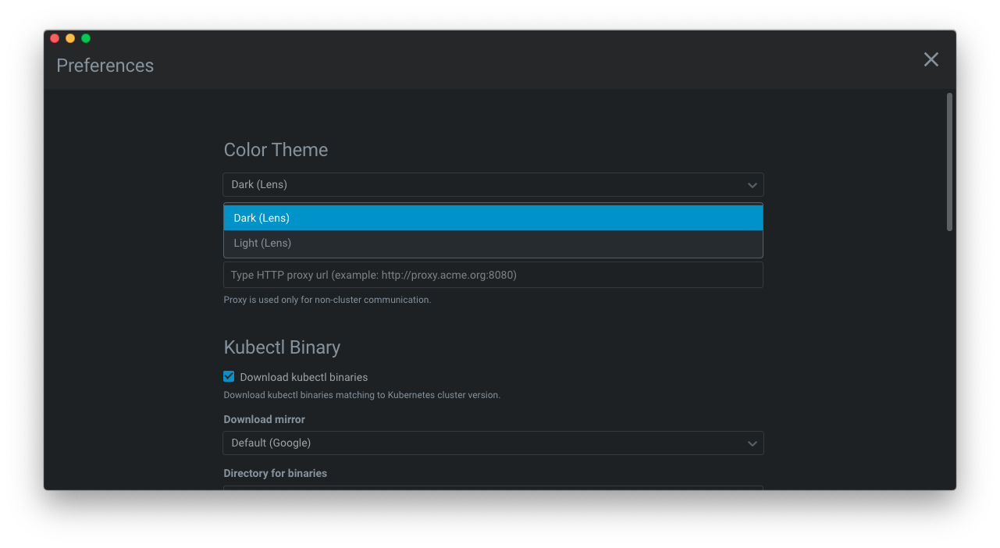

# Preferences

## Color Themes

The Color Themes option in Lens preferences lets you set the colors in the Lens user interface to suit your liking.

1. Go to **File** > **Preferences** (**Lens** > **Preferences** on Mac). Or follow [this link](lens://app/preferences?highlight=appearance).
2. Select your preferred theme from the **Color Theme** dropdown.

## Telemetry & Usage Tracking

Lens collects telemetry data, which is used to help us understand how to improve the product. For example, this usage data helps us to debug issues and to prioritize new features. While we appreciate the insights this data provides, we also know that not everyone wants to send usage data. Please see our [privacy statement](https://www.mirantis.com/company/privacy-policy/) to learn more.

### Disable Telemetry Reporting

If you don't wish to send usage data to Mirantis, you can disable the "Telemetry & Usage Tracking" in the Lens preferences.

1. Go to **File** > **Preferences** (**Lens** > **Preferences** on Mac). Or follow [this link](lens://app/preferences?highlight=telemetry-tracking).
2. Scroll down to **Telemetry & Usage Tracking**
3. Uncheck **Allow Telemetry & Usage Tracking**.

This will silence all telemetry events from Lens going forward. Telemetry information may have been collected and sent up until the point when you disable this setting.

